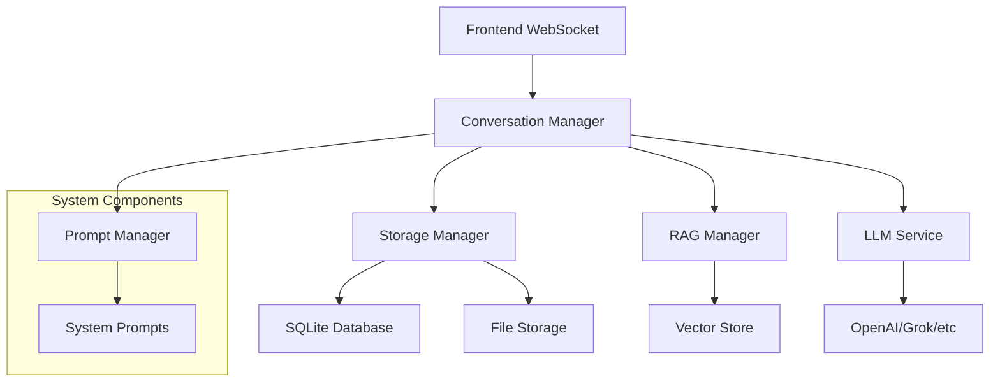

# AI Companion - LLM Integration Design

## Overview
Design for integrating Large Language Model (LLM) capabilities into the AI Companion system with intelligent conversation management, context engineering, and local storage.

## Requirements

### 1. System Prompt Management
- **Location**: `system_prompts.py`
- **Purpose**: Clean separation of prompts from code
- **Features**:
  - Multiple prompt templates for different contexts
  - Dynamic prompt selection based on conversation type
  - Variable substitution in prompts

### 2. Local Conversation Storage
- **Duration**: Forever (permanent storage)
- **Technology**: SQLite database
- **Purpose**: Persistent conversation history
- **Privacy**: Local-only storage, no cloud sync

### 3. Context Engineering
**Dual Storage Strategy:**
- **Summary Context**: Condensed conversation flow for LLM consumption
- **Full Archive**: Complete transcripts for reference and export

**Smart Summarization:**
- Periodic summarization every 10-15 exchanges
- Key points extraction and topic tracking
- Question-answer pair mapping
- Topic transition detection

### 4. RAG for Conversation References
- **Purpose**: Handle user references to past conversation parts
- **Example**: "Remember when I mentioned X..."
- **Technology**: Vector embeddings + semantic search
- **Implementation**: Lightweight vector store (Chroma/FAISS)

## Architecture



## Core Components

### 1. ConversationManager
**Responsibilities:**
- Manage conversation flow and context
- Coordinate between LLM, storage, and RAG
- Handle context window optimization
- Trigger summarization when needed

**Key Methods:**
- `add_message(user_message, ai_response)`
- `get_context_for_llm()`
- `summarize_recent_conversation()`
- `search_conversation(query)`

### 2. StorageManager
**Responsibilities:**
- SQLite database operations
- File storage for full transcripts
- Data persistence and retrieval
- Export functionality

**Database Schema:**
```sql
conversations (
    id, session_id, timestamp, 
    message_type, content, metadata
)

summaries (
    id, session_id, created_at, 
    summary_text, message_range
)

sessions (
    id, started_at, last_activity, 
    context_type, metadata
)
```

### 3. RAGManager
**Responsibilities:**
- Create vector embeddings of conversation chunks
- Semantic search for relevant past content
- Context retrieval for user references

**Implementation:**
- Chunk conversations into meaningful segments
- Generate embeddings using sentence-transformers
- Store in local vector database
- Semantic search on user queries

### 4. PromptManager
**Responsibilities:**
- Load system prompts from `system_prompts.py`
- Template processing with variables
- Context-specific prompt selection

**Prompt Categories:**
- Interview mode
- Casual conversation
- Technical discussion
- Creative brainstorming

## LLM Provider Strategy

### Current: OpenAI
- **Model**: GPT-4o for quality, GPT-3.5-turbo for speed
- **API**: Standard OpenAI Python client
- **Configuration**: Environment variables for API keys

### Future: Multi-Provider Support
- **Grok (xAI)**: Alternative provider option
- **Anthropic Claude**: For different reasoning style
- **Local Models**: Privacy-focused option
- **Implementation**: Provider abstraction layer

## Context Engineering Details

### Summarization Strategy
**Trigger Points:**
- Every 10-15 message exchanges
- When context approaches token limit
- Topic changes detected
- Time-based (every 30 minutes)

**Summary Content:**
- Key questions asked by user
- Important responses provided
- Decisions made or conclusions reached
- Action items or follow-ups

### Context Window Management
**Prioritization:**
1. Recent messages (last 5-10 exchanges)
2. Current session summaries
3. Relevant historical context (via RAG)
4. System instructions

**Optimization:**
- Dynamic context sizing based on model limits
- Intelligent truncation preserving important info
- Context compression for long conversations

## Privacy & Security

### Data Protection
- **Local Storage**: All conversation data stored locally
- **No Cloud Sync**: No automatic transmission to external services
- **API Keys**: Stored in environment variables only
- **User Control**: User can export/delete data at will

### Considerations
- LLM API calls send message content to provider
- Local embeddings may contain sensitive conversation snippets
- File permissions should restrict access to conversation data

## Implementation Phases

### Phase 1: Foundation
1. Create `system_prompts.py` with basic prompts
2. Implement SQLite storage schema
3. Basic conversation manager without summarization
4. OpenAI integration with simple context passing

### Phase 2: Context Engineering
1. Implement summarization logic
2. Add context window management
3. Create conversation export features
4. Test with long conversations

### Phase 3: RAG & References
1. Implement vector embeddings
2. Add semantic search capability
3. Handle user conversation references
4. Optimize retrieval accuracy

### Phase 4: Multi-Provider
1. Create provider abstraction layer
2. Add Grok integration
3. Implement provider switching
4. Add local model support

## Configuration

### Environment Variables
```bash
OPENAI_API_KEY=your_openai_key
GROK_API_KEY=your_grok_key
DEFAULT_LLM_PROVIDER=openai
CONVERSATION_DB_PATH=./data/conversations.db
VECTOR_STORE_PATH=./data/vectors
```

### Config Settings
```python
LLM_CONFIG = {
    "provider": "openai",
    "model": "gpt-4o",
    "temperature": 0.7,
    "max_tokens": 1000,
    "context_window": 8000
}

CONVERSATION_CONFIG = {
    "summarize_every": 12,  # messages
    "max_context_age": "30d",
    "embedding_model": "all-MiniLM-L6-v2"
}
```

## Success Metrics

### Functional
- ✅ Conversations saved permanently
- ✅ Context maintained across long sessions
- ✅ User can reference past conversation parts
- ✅ System prompts managed cleanly

### Performance
- Context retrieval time < 500ms
- Summarization processing time < 2s
- Semantic search accuracy > 85%
- Storage efficiency (compressed summaries)

### User Experience
- Natural conversation flow without context loss
- Quick reference to past discussions
- Transparent data management
- Easy export and backup options

## Future Considerations

### Potential Enhancements
- Conversation analytics and insights
- Multi-language support
- Voice-specific conversation profiles
- Integration with calendar/task management

### Scaling Considerations
- Multiple concurrent conversation sessions
- Conversation sharing between users
- Cloud backup options (opt-in)
- Advanced privacy features

---

*This design document serves as the architectural foundation for LLM integration in AI Companion. All implementation should reference this document for consistency and alignment with the overall vision.*
